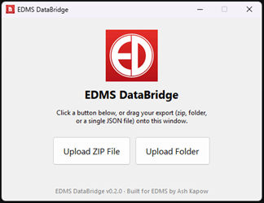

# EDMS DataBridge

[](https://github.com/AshKapow/EDMS-DataBridge/actions/workflows/ci.yml)
[](https://www.python.org/)
[](https://github.com/AshKapow/EDMS-DataBridge)
[](https://github.com/astral-sh/ruff)
[](LICENSE)

A small Windows desktop tool that lets a non-technical user upload (or
drag and drop) a JSON export (e.g. from Ambunet) and get back clean,
formatted Excel and PDF files.

Built primarily for EDMS (Emergency Doctors Medical Service) by Ash Kapow,
and released as open source (MIT license —
see [LICENSE](LICENSE)) for anyone else who runs into the same problem.

---

# For Users

No technical knowledge needed - these are the only steps you should have
to follow.

**1. Get the app.** Download `EDMSDataBridge.exe` from the
[latest release](https://github.com/AshKapow/EDMS-DataBridge/releases/latest).
It's a single file - no installer, nothing else to set up.

**2. First time opening it, Windows will show a "Windows protected your
PC" warning.** This is expected and it's safe to continue - the app
isn't digitally signed (a deliberate decision, not a mistake), so
Windows warns about any app it doesn't recognise. You'll only see this
once.

   1. Click **More info** (don't click **Don't run**):

      .png>)

   2. Check it says **Application: EDMSDataBridge.exe** (it will also
      say "Unknown publisher" - that's expected), then click
      **Run anyway**:

      .png>)

**3. Get your Ambunet export.** This is the zip file (or a folder you've
already unzipped) that Ambunet gives you when you request your data.
Don't unzip it yourself if you don't need to - the app can open the zip
directly.

**4. In the app, either:**
   - Click **Upload ZIP File** or **Upload Folder** and pick it, or
   - Just drag the zip/folder straight onto the app window.

   

**5. Choose a folder to save into.** The app fills it with one folder
per type of record - Audits, CAD Incidents, Shifts, Vehicles, and so on
(see below for what's inside them). There can be 60+ of these, so
**create a new, empty folder** for them rather than saving straight into
Documents or Downloads.
(If you upload a single JSON file with just one table in it, you'll be
asked for a filename instead and get back one Excel file.)

**6. That's it.** You'll get a confirmation showing what was created and
where. If anything goes wrong, you'll see a plain-English error message;
a more detailed log is automatically saved and the folder containing it
opens for you, in case you need to share it with whoever supports this
app.

## What you'll get back

Inside the folder you chose, you'll find one folder per type of record,
named after it (e.g. `Audits`, `CAD Incidents`, `Meetings`, `Shifts`).
Record types with no records at all in your export are skipped, so
you won't get any empty folders. Each folder holds one of two things:

- **A single Excel file** for list-style records (staff, shifts,
  vehicles, training records, and so on), named after its folder - e.g.
  `Shifts/Shifts.xlsx`.
- **One PDF per record** for record types that read much better as an
  actual document (patient records, incident reports, completed
  checklists, ...). These are filed by year and month, with the date
  first so they sort in date order, e.g.
  `CAD Incidents/2026/09 - September/2026-09-11 CAD 1109262001.pdf`.
  Filenames never include a person's name - patient records are named
  by their patient ID.

These are the record types that become PDFs:

| Record type | Folder |
|---|---|
| EPCR (electronic patient care record) | `ePCRs` |
| Incident Report | `Incident Reports` |
| CAD Incident | `CAD Incidents` |
| PTS Patient Record | `PTS Patients` (not split by date) |
| PTS Risk Assessment | `PTS Risk Assessments` |
| Employee Application | `Employee Applications` |
| Speak Up Concern | `Speak Up Concerns` |
| Meeting Minutes | `Meetings` |
| Event Plan | `Events` |
| Vehicle Daily Inspection | `Vehicle Daily Inspections` |
| Vehicle Clean Record | `Vehicle Cleans` |
| Vehicle Safety Check | `Vehicle Safety Checks` |
| Audit | `Audits` |
| Medicine Audit | `Medicine Audits` |
| Patient Feedback | `Patient Feedback` |
| Paper PCR | `Paper PCRs` |
| Medical Assessment | `Medical Assessments` |
| Occupational Health Record | `Occupational Health Records` |
| Uninjured Person Report | `Uninjured Person Reports` |
| Imaging Request | `Imaging Requests` |
| Employee Appraisal | `Appraisals` |
| Complex Decision Record | `Complex Decisions` |
| PEA Action | `PEA Actions` |

Everything else becomes a spreadsheet.

A PDF whose date is missing goes in an `Undated` folder instead of a
year/month one.

This list may grow or change as the app is refined - see the open
questions near the bottom of this README for anything still under review.

## Good to know

- **Images and other attached files aren't included yet.** If your export
  has photos or documents attached to records, those are currently
  skipped - only the data itself is converted. This is a known gap, not
  a bug (see open questions).
- **Some fields show as long codes (e.g. `6aa375ba64611cac41c15da2`)
  instead of a name.** These are internal reference IDs - Ambunet itself
  doesn't resolve them to names outside its own system either, so this
  matches how the data is actually structured, not a mistake in the
  conversion.
- **Passwords and similar credential fields are automatically removed**
  before anything is saved, even though the raw export technically
  includes them.

---

# For Developers

## Background

The company runs almost all core systems (patients, HR, shifts, etc.) on a
third-party SaaS called Ambunet. If the company ever leaves Ambunet, the
only guaranteed way to get data out is a raw JSON export. The author is
one of the only technical people at the company, so this tool exists to
make that export usable by a non-technical staff member without needing
manual help under time pressure, if/when a departure ever becomes urgent.

We now have a real (demo) Ambunet export to work from: a zip containing
one JSON file per entity (118 of them - employees, shifts, incidents,
EPCRs, etc.), in MongoDB Extended JSON format (IDs as `{"$oid": ...}`,
dates as `{"$date": ...}`, etc.). `clean_data()` in `edms_databridge.py`
unwraps that into plain values before anything else touches it.

## Status

Accepts a zip, a folder, or a single JSON file (button click or drag-and-
drop). Each entity is classified as either tabular (flattened into its own
Excel file - still a **generic** flatten, not bespoke per-entity column
naming/ordering) or document-shaped (case records with genuine narrative
content, and completed forms/checklists, get one PDF per record instead, laid out with
real sections and tables, branded with the EDMS logo on every page). See
`DOCUMENT_ENTITIES` in `edms_databridge.py` for the current classification
- reviewed against the actual generated output, not just guessed from
field names, though a handful of entities with no records in the demo
export are still unverified (see open questions).

Not yet tested as a built `.exe` on a clean machine (no dev tools/antivirus
false-positive check).

## Tech decisions

Python + Tkinter + pandas/openpyxl/reportlab, packaged as a single
unsigned `.exe` via PyInstaller (`--onefile --windowed`), chosen over
C#/.NET or Electron for speed of iteration given the author's background,
and because a single unsigned `.exe` is enough for an internal tool - no
installer needed.

Output is a mix of Excel (`.xlsx`, one file per tabular entity) and PDF
(one per record, for document-shaped entities) - see Status above and
`DOCUMENT_ENTITIES` in `edms_databridge.py`.

## Setup (dev machine)

```
python -m venv .venv
.venv\Scripts\activate
pip install -r requirements-dev.txt
```

`requirements-dev.txt` includes everything in `requirements.txt` (the
runtime deps used by the exe) plus `pytest` and `ruff` for testing/linting.

## Run without building an exe (for testing/dev)

```
python edms_databridge.py
```

## Testing & linting

Unit tests cover the core, GUI-free logic: JSON loading/parsing (including
mixed file encodings), the generic flatten (`process_data()`), Extended
JSON unwrapping and sensitive-field redaction (`clean_data()`), multi-file
folder/zip ingestion (including filtering out macOS packaging junk), PDF
generation, error logging, and the version/update-check helpers. The
Tkinter GUI itself (widgets, dialogs, actual drag-and-drop) is exercised
manually, not by automated tests.

```
pytest
ruff check .
```

CI (GitHub Actions, `.github/workflows/ci.yml`) runs both on every push and
pull request against `main`, then does a smoke-test build of the exe with
PyInstaller and uploads it as a workflow artifact, so a working build is
always downloadable without needing a local Python setup. On `main`
specifically it can also cut a full GitHub Release - see Versioning &
releases below.

## Build the standalone .exe

```
build.bat
```

`build.bat` auto-activates `.venv` if it exists next to the script, so
just run it after the dev setup above. It produces
`dist\EDMSDataBridge.exe` - a single file with no dependencies. That's
the file to hand to end users. They just double-click it, no Python
install needed on their machine.

Note: the exe is unsigned (a deliberate decision - signing isn't worth the
cost/hassle for one internal app), so Windows SmartScreen will show a
warning on first run ("Windows protected your PC"). Users click "More
info" → "Run anyway" - a one-time instruction, not a bug.

## Versioning & releases

The app follows [semantic versioning](https://semver.org/) (MAJOR.MINOR.PATCH).
The single source of truth is the [VERSION](VERSION) file - everything
else derives from it:

- **In-app footer** reads it at runtime and shows e.g. "EDMS DataBridge
  v0.1.0".
- **`version_info.txt`** (the exe's Windows file-properties metadata) is
  generated from it by `generate_version_info.py` - don't hand-edit
  `version_info.txt`, it'll just get overwritten on the next build.
  `build.bat` and CI both regenerate it automatically before building.
- **GitHub Releases**: on every push to `main`, CI checks whether
  `VERSION` names a version that doesn't have a release yet. If it's new,
  CI builds the exe, tags the commit `vX.Y.Z`, and creates a GitHub
  Release with the exe attached - that's what the team should download
  from, rather than building it themselves. Most pushes don't bump the
  version, so most CI runs skip this step entirely.

**To cut a release**: bump the version in the `VERSION` file (following
semver - patch for fixes, minor for new features, major for breaking
changes) as part of your PR. Once that PR merges to `main`, the release
is created automatically within a few minutes.

The app also does a quiet, best-effort check on startup for whether a
newer release exists (via the GitHub API) and shows a small clickable
notice if so - it never blocks startup or shows anything if the check
fails (no network, GitHub unreachable, etc).

## Branding

The in-app header shows the official EDMS "ED" mark (`assets/logo.png`).
The title bar, taskbar, and the built exe's file icon use a different,
DataBridge-specific mark (`assets/logo.ico`): a single bold document
icon, representing the file this tool produces - see
[assets/README.md](assets/README.md) for provenance and generation
details.

## Contributing

`main` is protected: changes go through a pull request with CI passing,
rather than a direct push, even for the repo owner. Required approvals
is set to 0 rather than 1, since GitHub never allows a PR author to
approve their own PR - with a single collaborator, requiring 1 would
make every PR permanently unmergeable without an admin override.

## Project structure

```
├── edms_databridge.py     # main app (GUI + processing logic)
├── assets/                # optional logo.png / logo.ico (see assets/README.md)
├── docs/                  # README-only images (kept out of assets/, which ships in the exe)
├── tests/                 # pytest unit tests for the processing logic
├── requirements.txt       # runtime deps (bundled into the exe)
├── requirements-dev.txt   # runtime deps + pytest/ruff for local dev & CI
├── pyproject.toml         # pytest and ruff config
├── build.bat              # builds the standalone exe
├── VERSION                # single source of truth for the app's version
├── generate_version_info.py # generates version_info.txt from VERSION
├── version_info.txt       # Windows file-properties metadata for the exe
├── .github/workflows/     # CI: lint, test, and build-smoke-test on push/PR
├── .github/ISSUE_TEMPLATE/ # bug report / feature request forms
├── .gitignore
├── LICENSE
└── README.md
```

## Open questions / next steps

1. **Bespoke per-entity polish** - `process_data()` still does a generic
   flatten for every tabular entity: raw field names as column headers,
   no reordering, deeply-nested repeating sub-records (e.g. a vehicle's
   service history) flatten to numeric-indexed columns rather than a
   proper linked sheet. Worth doing per-entity once there's a reason to
   (see `DOCUMENT_ENTITIES`'s more polished treatment for the document
   entities as the template for what "worth it" looks like).
2. **File attachments aren't handled at all** - confirmed via AmbuNet's own
   Data Export Policy that the real export includes an "object storage"/
   document bucket of actual files (images, PDFs) alongside the JSON, and
   several entities (e.g. `meetings`, and formerly `policies`) reference
   them by an S3 key. Right now those references just show as raw text;
   nothing copies, links, or embeds the actual files. Entities not
   included in a `.json`-only export (e.g. images the user has seen
   directly, like ID card photos) are silently skipped.
3. **Bespoke per-entity polish for the remaining tabular entities that
   deserve it** - e.g. `policies`/`sops`/`pgds` (moved out of
   `DOCUMENT_ENTITIES`, see below) are really acknowledgment-tracking
   records; a "who's acknowledged the latest version" summary view would
   be more useful than the raw flatten they get today.
4. **Distribution/signing** - settled: staying unsigned. SmartScreen's
   "More info -> Run anyway" is an acceptable one-time instruction for
   internal staff; a certificate isn't worth the hassle for one app.
5. **Clean-machine testing** - the built `.exe` hasn't been tested on a
   machine without dev tools/antivirus false-positive checks yet.

`DOCUMENT_ENTITIES` classification has now been reviewed against the real
generated output (not just guessed from field names) - see the comments
above that set for what changed and why. Six "formal document"
entities (`policies`, `policydescriptions`, `sops`, `pgds`, `coshhsheets`,
`statementofpurposes`) moved to tabular after inspection showed they're
acknowledgment/version-tracking metadata, not narrative content - the real
document text lives in an externally-linked file (see open question 2).
Completed forms (`vdis`, `vehiclecleans`, `vehiclesafetychecks`, `audits`,
`medicineaudits`), `patientfeedbacks` and `events` later moved the other
way, to PDFs: their nested checklist answers flattened into cells holding
whole lists, which a filled-in form layout reads far better as.
A handful of entities with 0 records in the demo export (`paperpcrs`,
`medicalassessments`, `occupationalhealths`, `uninjuredreports`,
`imagingrequests`, `appraisals`, `complexdecisions`) are still unverified
and kept as documents on domain reasoning alone.
